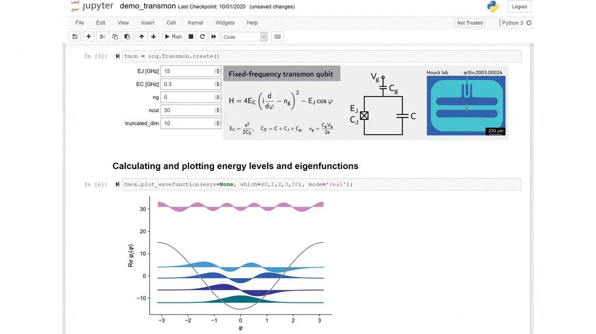

.. scqubits
   Copyright (C) 2019, Jens Koch & Peter Groszkowski

scQubits documentation
======================

scqubits is an open-source Python library for simulating superconducting qubits.

Getting Started
***************

After :ref:`Install` of scqubits, check out the
:doc:`User Guide <index>`, as well as the :doc:`Jupyter Examples <example-notebooks>`.

We are also building up a set of `YouTube Tutorials <https://www.youtube.com/channel/UCI43mhRw6oY01FbPuOc5CVQ>`_.

Overview
********

The package provides convenient tools for computing energy spectra of common superconducting qubits, plotting energy
levels as a function of external parameters, evaluating matrix elements, and predicting coherence times. scqubits
further offers an interface to QuTiP, making it easy to work with composite Hilbert spaces consisting of multiple
coupled superconducting qubits and harmonic modes.

scqubits relies on NumPy and SciPy for numerical computations, and on Matplotlib for plotting.

Citations
*********

If you employ scqubits in your research, please support its continued
development and maintenance. Use of scqubits in research publications is
appropriately acknowledged by citing:

   | Sai Pavan Chitta, Tianpu Zhao, Ziwen Huang, Ian Mondragon-Shem, and Jens Koch
   | *Computer-aided quantization and numerical analysis of superconducting circuits*
   | arXiv:2206.08320 (2022).
   | https://arxiv.org/abs/2206.08320

   | Peter Groszkowski and Jens Koch,
   | *scqubits:  a Python package for superconducting qubits*,
   | Quantum 5, 583 (2021).
   | https://quantum-journal.org/papers/q-2021-11-17-583/

.. toctree::
   :hidden:

   User Guide <index.rst>
   example-notebooks.rst
   installation.rst
   api-doc/apidoc.rst
   changelog.rst
   contributors.rst
   acknowledgments.rst
   bibliography.rst
