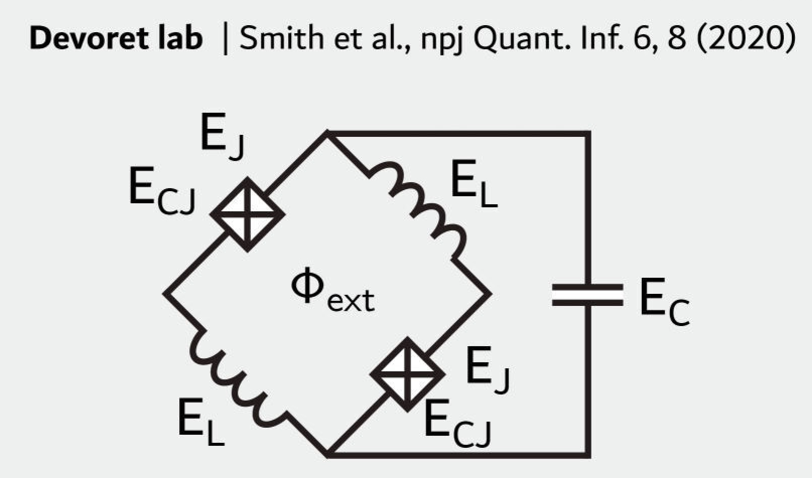
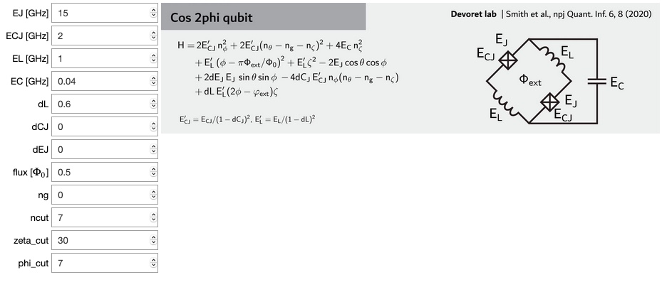

.. scqubits
   Copyright (C) 2017 and later, Jens Koch & Peter Groszkowski

.. _cos2phi_qubit:

Cos2phi Qubit
=========================

 
Without disorder in circuit parameters, the cos2phi qubit [Smith2020]_ is described by
the Hamiltonian

.. math::

   H = & \,2 E_\text{CJ}n_\phi^2 + 2 E_\text{CJ} (n_\theta - n_\text{g} - n_\zeta)^2 + 4 E_\text{C} n_\zeta^2\\
   & + E_\text{L}(\phi - \pi\Phi_\text{ext}/\Phi_0)^2 + E_\text{L} \zeta^2 - 2E_\text{J}\cos{\theta}\cos{\phi}.

In the presence of disorder, the circuit is described by

.. math::

    H = & \,2 E_\text{CJ}'n_\phi^2 + 2 E_\text{CJ}' (n_\theta - n_\text{g} - n_\zeta)^2 + 4 E_\text{C} n_\zeta^2\\
    & + E_\text{L}'(\phi - \pi\Phi_\text{ext}/\Phi_0)^2 + E_\text{L}' \zeta^2 - 2 E_\text{J}\cos{\theta}\cos{\phi} \\
    & + 2 dE_\text{J} E_\text{J}\sin{\theta}\sin{\phi} \\
    & - 4 dC_\text{J} E_\text{CJ}' n_\phi (n_\theta - n_\text{g}-n_\zeta) \\
    & + dL E_\text{L}'(2\phi - \varphi_\text{ext})\zeta ,

where :math:`E_\text{CJ}' = E_\text{CJ} / (1 - dC_\text{J})^2` and
:math:`E_\text{L}' = E_\text{L} / (1 - dL)^2`.

Here, the disorder is defined as follows: the inductive energies of the two inductors
are
:math:`E_\text{L1,2} = E_\text{L}/(1 \pm dL)`; the charging energies of
the two Josephson
junctions are :math:`E_\text{CJ1,2} = E_\text{CJ}/(1 \pm dC_\text{J})`; the
junction
energies of
the two Josephson junctions are :math:`E_\text{J1,2} = E_\text{J} (1 \pm
dE_\text{J})`.
Alternatively, the above relations can be rewritten as: :math:`dL =
(E_\text{L2}-E_\text{L1})/(E_\text{L2}+E_\text{L1}), E_\text{L} =
2E_\text{L1}E_\text{L2}/(E_\text{L1}+E_\text{L2})` for inductive energies,
:math:`dC_\text{J} =
(E_\text{CJ2}-E_\text{CJ1})/(E_\text{CJ1}+E_\text{CJ2}), E_\text{CJ} =
2E_\text{CJ1}E_\text{CJ2}/(E_\text{CJ1}+E_\text{CJ2})` for charging energies, and
:math:`dE_\text{J} =
(E_\text{J1}-E_\text{J2})/(E_\text{J1}+E_\text{J2}), E_\text{J} =
(E_\text{J1}+E_\text{J2})/2` for junction energies.

Here, we adopt notation that is consistent with other qubit classes. A conversion to
the notation used in Ref. [Smith2020]_ can be found in the following table.

.. list-table:: 
   :widths: 25 25

   * - Notation used here
     - Notation used in Ref. [Smith2020]_
   * - :math:`\zeta`
     - :math:`\theta`
   * - :math:`\theta`
     - :math:`\varphi`
   * - :math:`\phi`
     - :math:`\phi/2`  
   * - :math:`E_\text{C}`
     - :math:`E_\text{C} x` 
   * - :math:`E_\text{CJ}`
     - :math:`E_\text{C}` 

                
To numerically diagonalize the Hamiltonian of the cos2phi qubit, the harmonic basis
is used for both the :math:`\phi` and :math:`\zeta` variables, and the charge basis is
used
for
the :math:`\theta` variable. The user needs to specify cutoffs for basis states
described above, i.e.,
``phi_cut``, ``zeta_cut``, and ``ncut``, chosen large enough so that convergence is achieved.

An instance of the cos2phi qubit is initialized as follows::

   cos2phi_qubit = scqubits.Cos2PhiQubit(EJ = 15.0,
                                         ECJ = 2.0,
                                         EL = 1.0,
                                         EC = 0.04,
                                         dCJ = 0.0,
                                         dL = 0.6,
                                         dEJ = 0.0,
                                         flux = 0.5,
                                         ng = 0.0,
                                         ncut = 7,
                                         phi_cut = 7,
                                         zeta_cut = 30)

From within Jupyter notebook, a cos2phi qubit instance can alternatively be created
with::

   cos2phi_qubit = scqubits.Cosi2PhiQubit.create()

This functionality is  enabled if the ``ipywidgets`` package is installed, and displays GUI forms prompting for
the entry of the required parameters.

Calculational methods related to Hamiltonian and energy spectra
---------------------------------------------------------------

.. autosummary::
   :toctree: ../../_generated/

    scqubits.Cos2PhiQubit.hamiltonian
    scqubits.Cos2PhiQubit.eigenvals
    scqubits.Cos2PhiQubit.eigensys
    scqubits.Cos2PhiQubit.get_spectrum_vs_paramvals

Wavefunctions and visualization of eigenstates and the potential
----------------------------------------------------------------

.. autosummary::
   :toctree: ../../_generated/

    scqubits.Cos2PhiQubit.wavefunction
    scqubits.Cos2PhiQubit.plot_wavefunction
    scqubits.Cos2PhiQubit.plot_potential

Implemented operators
---------------------

The following operators are implemented for use in matrix element calculations.

.. autosummary::
   :toctree: ../../_generated/

    scqubits.Cos2PhiQubit.n_1_operator
    scqubits.Cos2PhiQubit.n_2_operator
    scqubits.Cos2PhiQubit.phi_1_operator
    scqubits.Cos2PhiQubit.phi_2_operator
    scqubits.Cos2PhiQubit.phi_operator
    scqubits.Cos2PhiQubit.n_phi_operator
    scqubits.Cos2PhiQubit.n_theta_operator
    scqubits.Cos2PhiQubit.zeta_operator
    scqubits.Cos2PhiQubit.n_zeta_operator

Computation and visualization of matrix elements
------------------------------------------------

.. autosummary::
   :toctree: ../../_generated/

    scqubits.Cos2PhiQubit.matrixelement_table
    scqubits.Cos2PhiQubit.plot_matrixelements
    scqubits.Cos2PhiQubit.get_matelements_vs_paramvals
    scqubits.Cos2PhiQubit.plot_matelem_vs_paramvals

   
Estimation of coherence times
-----------------------------

.. autosummary::
   :toctree: ../../_generated/

    scqubits.Cos2PhiQubit.plot_coherence_vs_paramvals
    scqubits.Cos2PhiQubit.plot_t1_effective_vs_paramvals
    scqubits.Cos2PhiQubit.plot_t2_effective_vs_paramvals
    scqubits.Cos2PhiQubit.t1_effective
    scqubits.Cos2PhiQubit.t2_effective
    scqubits.Cos2PhiQubit.t1_capacitive
    scqubits.Cos2PhiQubit.t1_inductive
    scqubits.Cos2PhiQubit.t1_purcell
    scqubits.Cos2PhiQubit.tphi_1_over_f
    scqubits.Cos2PhiQubit.tphi_1_over_f_cc
    scqubits.Cos2PhiQubit.tphi_1_over_f_flux
    scqubits.Cos2PhiQubit.tphi_1_over_f_ng
