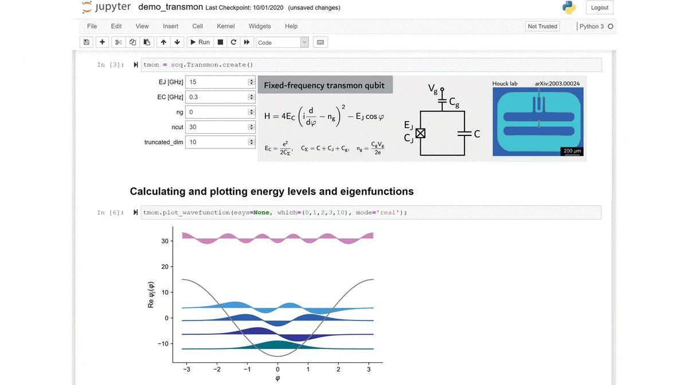

.. scqubits
   Copyright (C) 2019, Jens Koch & Peter Groszkowski

scQubits documentation
======================

scqubits is an open-source Python library for simulating superconducting qubits.

The package provides convenient ways to obtain energy spectra of common superconducting qubits, to plot their energy
levels as a function of external parameters, to calculate matrix elements and predict coherence times etc. scqubits
further offers an interface to QuTiP, making it easy to work with composite Hilbert spaces consisting of multiple
coupled superconducting qubits and harmonic modes.

scqubits performs numerics utilizing Numpy and Scipy; plotting capabilities rely on Matplotlib.

If you employ scqubits in your research, please support its continued
development and maintenance. Use of scqubits in research publications is
appropriately acknowledged by citing:

   | Sai Pavan Chitta, Tianpu Zhao, Ziwen Huang, Ian Mondragon-Shem, and Jens Koch
   | *Computer-aided quantization and numerical analysis of superconducting circuits*
   | arXiv:2206.08320 (2022).
   | https://arxiv.org/abs/2206.08320

   | Peter Groszkowski and Jens Koch,
   | *scqubits:  a Python package for superconducting qubits*,
   | Quantum 5, 583 (2021).
   | https://quantum-journal.org/papers/q-2021-11-17-583/

.. toctree::
   :maxdepth: 2
   :hidden:

   installation.rst
   example-notebooks.rst
   guide/guide.rst
   api-doc/apidoc.rst
   changelog.rst
   contributors.rst
   acknowledgments.rst
   bibliography.rst
